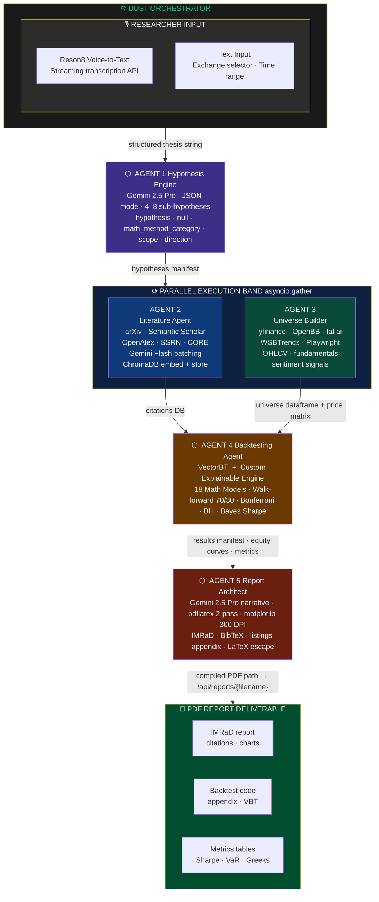
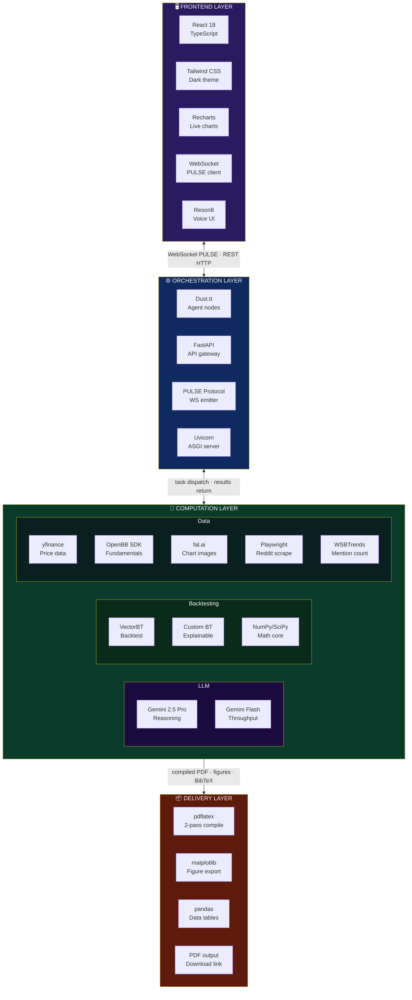
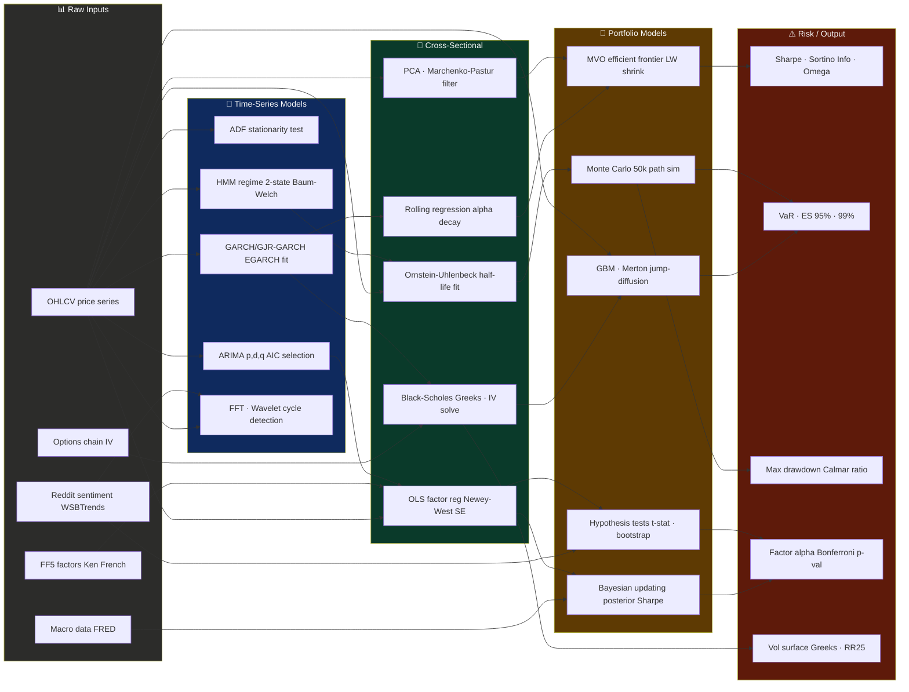
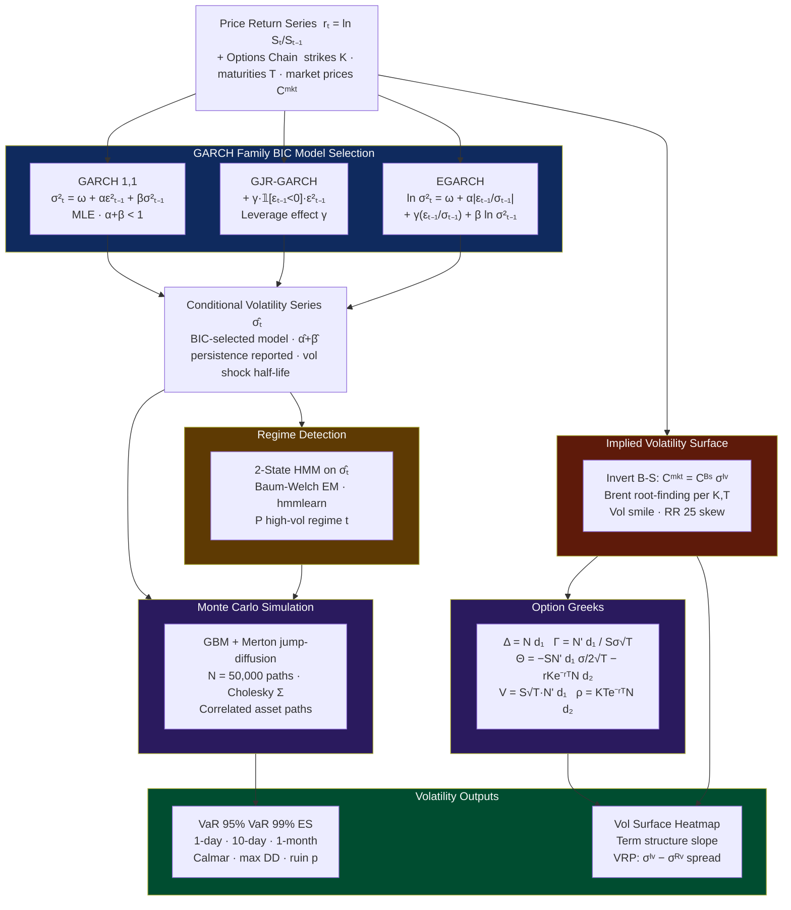
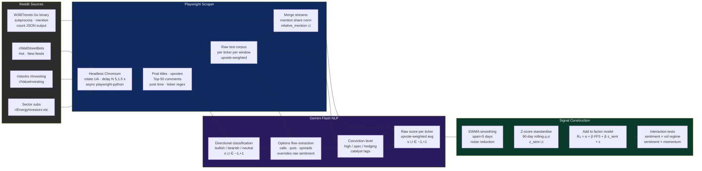
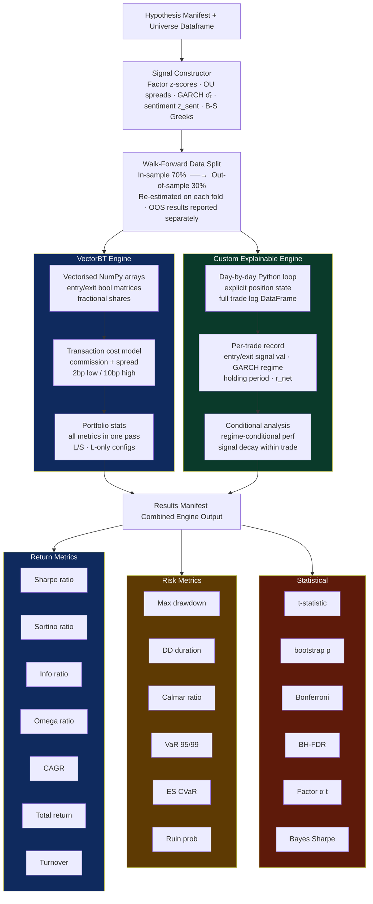
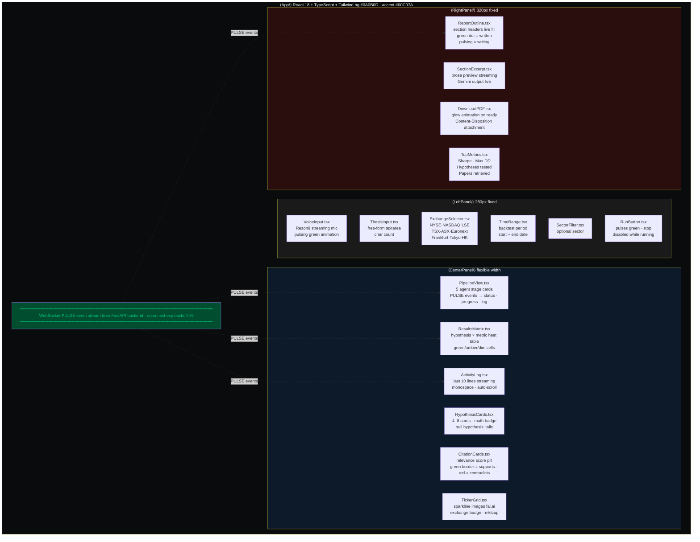
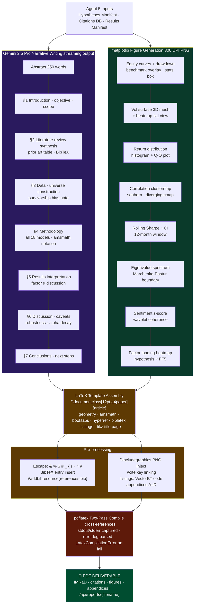
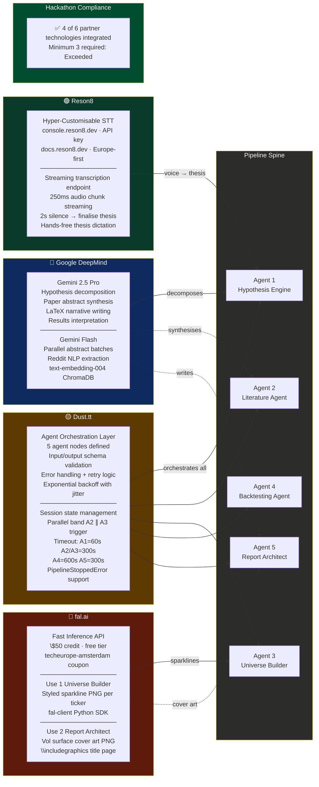

<div align="center">
  
  <h1>Octant AI 🐙</h1>
  <h3>Autonomous Research & Quantitative Analysis Workbench</h3>

<br/>

*From a spoken investment thesis to a publication-quality quantitative research PDF in under 60 minutes.*

<br/>

[](https://python.org)
[](https://react.dev)
[](https://fastapi.tiangolo.com)
[](https://typescriptlang.org)
[](https://tailwindcss.com)
[](https://vectorbt.dev)
[](https://www.latex-project.org)
[](LICENSE)

<br/>

<table>
<tr>
<td align="center"><b>5 Agents</b><br/><sub>Fully autonomous pipeline</sub></td>
<td align="center"><b>18 Math Models</b><br/><sub>GARCH · B-S · PCA · MVO</sub></td>
<td align="center"><b>12 Data Sources</b><br/><sub>Academic + market + sentiment</sub></td>
<td align="center"><b>50,000 MC Paths</b><br/><sub>VaR · ES · ruin probability</sub></td>
<td align="center"><b>IMRaD PDF</b><br/><sub>Goldman-grade LaTeX report</sub></td>
</tr>
</table>

</div>

---

## Table of Contents

- [What Is Octant AI?](#-what-is-octant-ai)
- [The Problem It Solves](#-the-problem-it-solves)
- [Diagram 1 End-to-End Pipeline](#diagram-1--end-to-end-agent-pipeline)
- [Diagram 2 Three-Layer Stack Architecture](#diagram-2--three-layer-stack-architecture)
- [Diagram 3 Mathematical Model Dependency Graph](#diagram-3--mathematical-model-dependency-graph)
- [Diagram 4 Data Acquisition Network](#diagram-4--data-acquisition-network)
- [Diagram 5 Volatility Analysis Sub-Pipeline](#diagram-5--volatility-analysis-sub-pipeline)
- [Diagram 6 Reddit Sentiment Pipeline](#diagram-6--reddit-sentiment-pipeline)
- [Diagram 7 Dual Backtesting Engine](#diagram-7--dual-backtesting-engine)
- [Diagram 8 React Frontend Layout](#diagram-8--react-frontend-three-panel-layout)
- [Diagram 9 Report Generation Pipeline](#diagram-9--report-generation-pipeline)
- [Diagram 10 Partner Technology Map](#diagram-10--partner-technology-integration-map)
- [Mathematical Model Registry](#-mathematical-model-registry)
- [The PULSE Protocol](#-the-pulse-websocket-protocol)
- [Performance Metrics](#-performance-metrics-all-18)
- [Report Structure](#-report-structure--IMRaD-format)
- [Partner Technologies](#-hackathon-partner-technologies)
- [Project Structure](#-project-structure)
- [Installation](#-installation)
- [Quick Start](#-quick-start)
- [Demo Thesis Examples](#-demo-thesis-examples)
- [Known Limitations](#-known-limitations)

---

## 🐙 What Is Octant AI?

Octant AI is a **privacy-first, autonomous quantitative research workbench**. A quant researcher inputs a natural-language investment thesis spoken via the Reson8 voice API or typed and the system:

1. **Decomposes** it into 4–8 independently testable sub-hypotheses using Gemini 2.5 Pro
2. **Retrieves and analyses** academic literature from 6 sources (arXiv, Semantic Scholar, OpenAlex, SSRN, CORE, Modern Finance)
3. **Builds a qualifying equity universe** across selectable global exchanges with liquidity screening
4. **Downloads and cleans** 20+ years of historical price data with corporate action adjustments
5. **Scrapes social sentiment** from Reddit (WallStreetBets + 5 other communities) via Playwright + WSBTrends
6. **Runs dual backtests** VectorBT for speed, custom engine for explainability with 18 mathematical models applied per hypothesis
7. **Compiles a publication-quality PDF** report typeset in LaTeX with matplotlib figures, BibTeX citations, and full statistical appendices

Every stage streams real-time status updates to the React frontend via a custom WebSocket protocol called **PULSE**.

---

## The Problem It Solves

A senior quantitative researcher at a hedge fund faces a research cycle that typically unfolds over **3–7 days** per hypothesis:

| Stage | Time Cost | Pain Point |
|---|---|---|
| Literature search | 6–8 hours | Manual keyword search across disconnected sources |
| Universe definition | 2–4 hours | Exchange selection, sector filtering, liquidity screens |
| Data sourcing | 3–5 hours | No Bloomberg? Manual CSV downloads |
| Backtesting | 4–6 hours | Survivorship bias, corporate actions, transaction costs |
| Statistical validation | 3–4 hours | Multiple testing corrections, bootstrap p-values |
| Report writing | 6–8 hours | LaTeX formatting, chart generation, citation management |

**Octant AI compresses this to under 60 minutes.**

For retail algorithmic traders the 300,000+ users on QuantConnect, Alpaca, and Interactive Brokers the same process takes weeks or never happens at all. Octant AI democratises institutional-grade quantitative research.

---

## Diagram 1 End-to-End Agent Pipeline



> **PULSE WebSocket** emits real-time events at every stage milestones (hypothesis cards, citation cards, ticker cards, metrics results, and report section excerpts) all stream live to the React frontend.

---

## Diagram 2 Three-Layer Stack Architecture



---

## Diagram 3 Mathematical Model Dependency Graph



> **Key equations inline:**
> `GBM: dS = μS dt + σS dW(t)` &nbsp;|&nbsp; `OU: dX = κ(θ − X)dt + σdW(t)` &nbsp;|&nbsp; `EGARCH: ln σ²ₜ = ω + α|εₜ₋₁/σₜ₋₁| + γ(εₜ₋₁/σₜ₋₁) + β ln σ²ₜ₋₁`

---

## Diagram 4 Data Acquisition Network

```mermaid
graph TB
    subgraph ACAD["📚 Academic / Literature Sources"]
        direction LR
        AX["arXiv q-fin\nREST · no key\nST·PM·TR·MF·RM"]
        SS["Semantic Scholar\n100 req/s free\ntldr · influence scores"]
        OA["OpenAlex\nno auth · 250M works\nconcept tags"]
        SR["SSRN\nPlaywright scraper\nworking papers"]
        CO["CORE API\n10k req/mo free\nfull-text PDFs"]
        MF["Modern Finance\nopen-access OA\nPyMuPDF extract"]
    end

    subgraph MKTD["📈 Market Data Sources"]
        direction LR
        YF["yfinance\nOHLCV · 20yr · global\nauto_adjust=True"]
        OB["OpenBB SDK\nfundamentals · short int\nFRED macro data"]
        FA["fal.ai\nfast inference API\nchart image gen"]
    end

    subgraph SENTI["💬 Sentiment Sources"]
        direction LR
        WB["WSBTrends Go\nsubprocess call\nmention counts JSON"]
        PW["Playwright\nheadless Chromium\nWSB · 6 subreddits"]
        GF["Gemini Flash\nsentiment extraction\nstructured JSON out"]
    end

    HUB["⚡ FastAPI Data Layer\nAsync Hub"]

    subgraph AGENTS["Destination Agents"]
        AG2["Agent 2\nLiterature"]
        AG3["Agent 3\nUniverse"]
        AG4["Agent 4\nBacktester"]
    end

    AX & SS & OA & SR & CO & MF --> HUB
    YF & OB & FA --> HUB
    WB & PW & GF --> HUB

    HUB --> AG2
    HUB --> AG3
    HUB --> AG4

    style ACAD fill:#2a1a5e,color:#F8F9FA
    style MKTD fill:#0a3a2a,color:#F8F9FA
    style SENTI fill:#5e3a03,color:#F8F9FA
    style HUB fill:#0f2a5e,color:#F8F9FA
    style AGENTS fill:#2C2C2A,color:#F8F9FA
```



### Exchange Universe Coverage

| Exchange | Suffix | Region | Notes |
|---|---|---|---|
| NYSE | (none) | US | Full S&P 500 universe |
| NASDAQ | (none) | US | Tech-weighted |
| LSE | `.L` | UK | FTSE 350 constituents |
| TSX | `.TO` | Canada | TSX Composite |
| ASX | `.AX` | Australia | ASX 200 |
| Euronext Paris | `.PA` | France | CAC 40 |
| Euronext Amsterdam | `.AS` | Netherlands | AEX |
| Frankfurt XETRA | `.DE` | Germany | DAX |
| Tokyo | `.T` | Japan | Nikkei 225 |
| Hong Kong | `.HK` | HK | Hang Seng |

**Liquidity screen applied to all exchanges:** minimum average daily volume 500k shares · minimum price $1.00 · maximum estimated bid-ask spread 1%

---

## Diagram 5 Volatility Analysis Sub-Pipeline



### Volatility Model Specifications

| Model | Equation | Key Parameter | Library |
|---|---|---|---|
| GARCH(1,1) | `σ²ₜ = ω + αε²ₜ₋₁ + βσ²ₜ₋₁` | `α+β` persistence | `arch.arch_model` |
| GJR-GARCH | `+ γ·𝟙[εₜ₋₁<0]·ε²ₜ₋₁` | `γ` leverage effect | `arch.arch_model` |
| EGARCH | `ln σ²ₜ = ω + α\|z\| + γz + β ln σ²ₜ₋₁` | No positivity constraint | `arch.arch_model` |
| HMM Regime | 2-state Gaussian · Baum-Welch | Transition matrix P | `hmmlearn` |
| B-S IV Solve | Brent root-find `C_BS(σ) = C_market` | Bracket [1e-6, 10.0] | `scipy.optimize.brentq` |

---

## Diagram 6 Reddit Sentiment Pipeline



### Sentiment Signal Formula

$$z_{sent}(i,t) = \frac{s(i,t) - \mu_{90}(i)}{\sigma_{90}(i)}$$

Where $s(i,t)$ is the upvote-weighted directional score, $\mu_{90}$ and $\sigma_{90}$ are rolling 90-day mean and standard deviation. The signal is then added as regressor: $R_{it} = \alpha + \sum_j \beta_j F_{jt} + \beta_k z_{sent}(i,t) + \varepsilon_{it}$

### Playwright Anti-Detection

| Measure | Implementation |
|---|---|
| Request delay | `random.normalvariate(5, 1.5)` seconds, clamped to [3, 8] |
| User agent | Current Chrome stable UA string, rotated per session |
| Navigation pattern | Random subreddit order, variable comment depth 20–50 |
| Content wait | `page.wait_for_selector('.Post', timeout=15000)` |
| Rate limiting | Graceful degradation pipeline continues without sentiment on timeout |

---

## Diagram 7 Dual Backtesting Engine



### Trade Log Fields (Custom Engine)

Every trade in the custom engine produces a record with these fields:

`entry_date` · `exit_date` · `ticker` · `entry_price` · `exit_price` · `entry_signal_value` · `exit_signal_value` · `holding_period_days` · `return_gross` · `return_net` · `transaction_costs_bps` · `garch_vol_at_entry` · `regime_state_at_entry` · `signal_zscore_at_entry`

---

## Diagram 8 React Frontend Three-Panel Layout



### Voice Input Flow Reson8

```
Browser mic → MediaRecorder → 250ms audio chunks
     ↓
WebSocket → /api/voice/transcribe → Reson8 streaming API
     ↓
Partial transcript → PULSE payload_type="transcription" → ThesisInput.tsx
     ↓
2-second silence detected → "transcription_complete" → thesis locked → RunButton active
```

---

## Diagram 9 Report Generation Pipeline



### LaTeX Packages Used

| Package | Purpose |
|---|---|
| `geometry` | A4 paper, 2cm margins |
| `amsmath` + `amssymb` | All mathematical notation |
| `booktabs` + `array` | Professional metrics tables |
| `graphicx` | `\includegraphics` PNG figures |
| `biblatex` | BibTeX citation management |
| `listings` | Syntax-highlighted backtest code |
| `hyperref` | Clickable cross-references |
| `microtype` | Professional typographic refinement |
| `tikz` | Title page header decoration |
| `lmodern` + `[T1]{fontenc}` | Full font encoding |

---

## Diagram 10 Partner Technology Integration Map



---

## Mathematical Model Registry

All 18 models are applied per hypothesis by Agent 4.

<details>
<summary><b>1. ADF Stationarity Test</b></summary>

Tests $H_0$: unit root present in the return series. The ADF statistic is compared to critical values at 1%, 5%, and 10% significance. If the price series is non-stationary (almost always), the first-differenced log return series is tested. Integration order `d` is recorded per ticker and passed to ARIMA.

**Implementation:** `statsmodels.tsa.stattools.adfuller`

</details>

<details>
<summary><b>2. ARIMA(p,d,q) Modelling</b></summary>

Grid search over $p \in \{0..5\}$, $q \in \{0..5\}$, $d$ fixed from ADF result. Model selection by:

$$\text{AIC} = 2k - 2\ln(\hat{\mathcal{L}})$$

Fitted coefficients, AIC, and one-step-ahead forecast residuals stored per ticker.

**Implementation:** `statsmodels.tsa.arima.model.ARIMA`

</details>

<details>
<summary><b>3–5. GARCH Family (three variants, BIC-selected)</b></summary>

**GARCH(1,1):**
$$\sigma^2_t = \omega + \alpha\varepsilon^2_{t-1} + \beta\sigma^2_{t-1}, \quad \alpha+\beta < 1$$

**GJR-GARCH (leverage effect):**
$$\sigma^2_t = \omega + \alpha\varepsilon^2_{t-1} + \gamma\,\mathbf{1}[\varepsilon_{t-1}<0]\varepsilon^2_{t-1} + \beta\sigma^2_{t-1}$$

**EGARCH (no positivity constraint):**
$$\ln\sigma^2_t = \omega + \alpha\left|\frac{\varepsilon_{t-1}}{\sigma_{t-1}}\right| + \gamma\frac{\varepsilon_{t-1}}{\sigma_{t-1}} + \beta\ln\sigma^2_{t-1}$$

Selection by $\text{BIC} = k\ln(n) - 2\ln(\hat{\mathcal{L}})$.

**Implementation:** `arch.arch_model` with `dist='Normal'`

</details>

<details>
<summary><b>6. HMM Volatility Regime Detection</b></summary>

2-state Hidden Markov Model fitted to the GARCH conditional variance series $\hat{\sigma}^2_t$. States: low-vol (State 0), high-vol (State 1). Transition probability matrix $\mathbf{P}$ and emission parameters estimated via Baum-Welch EM. Output: $P(\text{high-vol regime} \mid \text{data}, t)$ for each date.

**Implementation:** `hmmlearn.hmm.GaussianHMM`

</details>

<details>
<summary><b>7. FFT + Wavelet Analysis</b></summary>

**FFT:** `numpy.fft.fft` on return series → power spectrum $|X(f)|^2$. Fisher's g-statistic identifies peaks significantly above expected flat i.i.d. spectrum.

**Wavelet:** Morlet continuous wavelet transform via `pywt.cwt` detects time-varying correlation between sentiment signal and returns. Output: wavelet coherence heatmap PNG.

</details>

<details>
<summary><b>8. OLS Fama-French 5-Factor Regression</b></summary>

$$R_{it} = \alpha_i + \beta_1\text{MKT}_t + \beta_2\text{SMB}_t + \beta_3\text{HML}_t + \beta_4\text{MOM}_t + \beta_5\text{RMW}_t + \beta_6\text{CMA}_t + \varepsilon_{it}$$

OLS estimator: $\hat{\beta} = (X'X)^{-1}X'y$. Standard errors: Newey-West HAC with lag $= \lfloor 4(T/100)^{2/9} \rfloor$. Factor data from Ken French's free library.

**Implementation:** `statsmodels.OLS` with `cov_type='HAC'`

</details>

<details>
<summary><b>9. Rolling Regression Alpha Decay</b></summary>

12-month rolling window OLS. Rolling $\hat{\alpha}_t$ series plotted over time. Sharpe ratio of the $\hat{\alpha}_t$ series measures consistency. Strategies with declining recent alpha flagged as "potential decay."

</details>

<details>
<summary><b>10. Black-Scholes Model + Greeks</b></summary>

$$C = SN(d_1) - Ke^{-rT}N(d_2), \quad d_1 = \frac{\ln(S/K) + (r+\sigma^2/2)T}{\sigma\sqrt{T}}, \quad d_2 = d_1 - \sigma\sqrt{T}$$

| Greek | Formula |
|---|---|
| Delta | $\Delta = N(d_1)$ |
| Gamma | $\Gamma = N'(d_1) / (S\sigma\sqrt{T})$ |
| Theta | $\Theta = -SN'(d_1)\sigma/(2\sqrt{T}) - rKe^{-rT}N(d_2)$ |
| Vega | $\mathcal{V} = S\sqrt{T}N'(d_1)$ |
| Rho | $\varrho = KTe^{-rT}N(d_2)$ |

Implied vol: Brent's method `scipy.optimize.brentq`, bracket `[1e-6, 10.0]`.

</details>

<details>
<summary><b>11. Ornstein-Uhlenbeck Process</b></summary>

$$dX(t) = \kappa(\theta - X(t))\,dt + \sigma\,dW(t)$$

Discrete OLS fit: $\Delta X_t = \alpha + \beta X_{t-1} + \varepsilon_t$

$$\kappa = -\ln(1+\beta)/\Delta t, \quad \theta = -\alpha/\beta, \quad \text{half-life} = \ln(2)/\kappa$$

Pairs with half-life < 20 trading days flagged as strong mean-reversion candidates.

</details>

<details>
<summary><b>12. GBM + Merton Jump-Diffusion</b></summary>

**GBM:** $dS = \mu S\,dt + \sigma S\,dW(t)$ → $S(t) = S(0)\exp\!\left((\mu - \sigma^2/2)t + \sigma W(t)\right)$

Note: Itô correction $-\sigma^2/2$ is non-trivial (8 pp/yr for $\sigma=40\%$).

**Merton:** $dS/S = (\mu - \lambda\bar{k})dt + \sigma dW + (e^J - 1)dN(t)$

Where $N(t) \sim \text{Poisson}(\lambda)$, $J \sim \mathcal{N}(\mu_J, \sigma_J^2)$, $\bar{k} = e^{\mu_J + \sigma_J^2/2} - 1$.

Jump identification: returns exceeding $3\hat{\sigma}_t$ (GARCH-scaled).

</details>

<details>
<summary><b>13. Monte Carlo Simulation 50,000 Paths</b></summary>

**GBM discretisation:** $S(t+\Delta t) = S(t)\exp\!\left((\mu - \sigma^2/2)\Delta t + \sigma\sqrt{\Delta t}\,Z_t\right)$

**Correlated portfolio:** $\mathbf{R}(t) = \boldsymbol{\mu}\Delta t + L\mathbf{Z}(t)\sqrt{\Delta t}$ where $L$ is the lower Cholesky factor of $\hat{\Sigma}$ (Ledoit-Wolf shrinkage). If $\Sigma$ not PD → Higham (1988) nearest-PD algorithm applied.

**Output:** VaR and ES at $\alpha \in \{95\%, 99\%\}$ for $h \in \{1\text{-day}, 10\text{-day}, 1\text{-month}\}$.

</details>

<details>
<summary><b>14. PCA + Marchenko-Pastur Noise Filter</b></summary>

$$\Sigma = VDV', \quad \lambda_{max} = \sigma^2(1 + \sqrt{q})^2, \quad q = N/T$$

Eigenvalues above $\lambda_{max}$ carry genuine signal. Below: consistent with random noise. Retained PCs used for: dimensionality reduction in large universes, factor model robustness, correlation visualisation.

</details>

<details>
<summary><b>15. Mean-Variance Optimisation + Ledoit-Wolf</b></summary>

$$\min_w\; w'\hat{\Sigma}w \quad \text{s.t.}\quad w'\mu = \mu^*, \; \sum_i w_i = 1, \; w_i \geq 0$$

**Ledoit-Wolf shrinkage:** $\hat{\Sigma} = (1-\delta)\Sigma_{sample} + \delta\Sigma_{target}$, optimal $\delta^*$ computed analytically.

**Implementation:** `scipy.optimize.minimize(method='SLSQP')`

</details>

<details>
<summary><b>16. Hypothesis Testing Battery</b></summary>

**t-test:** $t = \bar{R} / (\sigma_R / \sqrt{T})$ vs $t_{T-1}$. Two-tailed + one-sided.

**Bootstrap Sharpe p-value:** $B = 10{,}000$ resamples. $p = \text{fraction}(\widehat{SR}_{boot} \geq \widehat{SR}_{obs})$.

**Bonferroni:** threshold $\alpha/N$ for $N$ hypotheses.

**Benjamini-Hochberg FDR:** reject $H_i$ if $p_{(i)} \leq (i/N)\alpha$. Controls FDR at 5%.

**Labels:** *strongly significant* (Bonferroni ✓) · *significant* (BH only) · *not significant* (both fail).

</details>

<details>
<summary><b>17. Bayesian Updating</b></summary>

Prior: $\text{SR} \sim \mathcal{N}(\mu_0, \sigma_0^2)$ from literature effect sizes (extracted by Gemini Flash).

$$\mu_{post} = \frac{\sigma_0^{-2}\mu_0 + (T/\sigma^2)\widehat{SR}}{\sigma_0^{-2} + T/\sigma^2}$$

Precision-weighted average. Reported as "Bayes-adjusted Sharpe" a more conservative and calibrated estimate.

</details>

<details>
<summary><b>18. Survivorship Bias Correction</b></summary>

yfinance only provides currently-listed tickers. Correction applied to CAGR:

| Cap Tier | Annual Correction |
|---|---|
| Large-cap | −0.5%/yr |
| Mid-cap | −1.5%/yr |
| Small-cap | −2.0%/yr |

Cited methodology: Harvey, Liu & Zhu (2016) *"And the Cross-Section of Expected Returns"* also motivates raising the t-stat significance threshold from 2.0 to 3.0 for published factors.

</details>

---

## ⚡ The PULSE WebSocket Protocol

PULSE (Proprietary Unified Live Status Emission) is the custom WebSocket event schema that streams agent state to the frontend in real time.

```json
{
  "type": "PULSE",
  "agent": "hypothesis_engine | literature | universe | backtest | architect",
  "status": "pending | active | complete | error",
  "progress": {
    "current_step": 3,
    "total_steps": 8,
    "percent_complete": 37,
    "estimated_remaining_sec": 45
  },
  "payload_type": "status | hypothesis_card | citation_card | ticker_card | metric_result | report_section | transcription | error",
  "payload": { },
  "message": {
    "title": "Analysing arXiv papers",
    "subtitle": "Processing batch 3/12..."
  },
  "timestamp": "2025-03-21T10:45:00Z"
}
```

### Extended Payload Types

| `payload_type` | Fields |
|---|---|
| `hypothesis_card` | `id` · `statement` · `null` · `math_badge` · `direction` |
| `citation_card` | `title` · `authors` · `year` · `journal` · `relevance` · `supports` · `abstract_summary` |
| `ticker_card` | `symbol` · `name` · `exchange` · `sector` · `sparkline_url` · `mktcap` · `short_interest` |
| `metric_result` | `hypothesis_id` · `sharpe` · `sortino` · `max_dd` · `cagr` · `alpha_t` · `p_value` · `bonferroni_pass` · `bh_pass` |
| `report_section` | `section_name` · `excerpt` · `is_complete` |
| `transcription` | `partial_text` · `is_final` |

---

## Performance Metrics All 18

| Category | Metric | Formula / Notes |
|---|---|---|
| **Return** | Total return | Cumulative P&L |
| **Return** | CAGR | $(1+R_{total})^{252/T} - 1$ |
| **Return** | Annualised excess return | Above risk-free rate |
| **Return** | Benchmark excess return | Above benchmark CAGR |
| **Risk** | Annualised volatility | $\sigma_{daily} \times \sqrt{252}$ |
| **Risk** | Maximum drawdown | $\max_{t \leq \tau} [S_\tau - S_t] / S_t$ |
| **Risk** | DD duration | Peak-to-recovery in trading days |
| **Risk** | Calmar ratio | CAGR / Max drawdown |
| **Risk** | Drawdown-at-risk 95% | DD exceeded in 5% of rolling windows |
| **Risk-adj** | Sharpe ratio | $(R_p - R_f) / \sigma_p$ |
| **Risk-adj** | Sortino ratio | $(R_p - R_f) / \sigma_{downside}$ |
| **Risk-adj** | Information ratio | $(R_p - R_b) / \sigma_{tracking}$ |
| **Risk-adj** | Omega ratio | $\int_L^\infty [1-F(r)]dr / \int_{-\infty}^L F(r)dr$ |
| **Statistical** | t-statistic | $\bar{R} / (\sigma_R / \sqrt{T})$ |
| **Statistical** | Bootstrap p-value | B=10,000 resamples |
| **Statistical** | Factor alpha t-stat | From FF5 OLS regression |
| **Statistical** | Bonferroni threshold | $\alpha / N$ hypotheses |
| **Statistical** | Bayes-adjusted Sharpe | Normal-Normal posterior mean |
| **Cost** | Break-even cost (bps) | Net return = 0 threshold |
| **Cost** | Return at 2bp/10bp | Sensitivity analysis |
| **Volatility** | GARCH persistence | $\hat{\alpha} + \hat{\beta}$ |
| **Volatility** | Regime fraction high-vol | % of days in HMM State 1 |
| **Sentiment** | Sentiment factor loading | $\hat{\beta}_k$ on $z_{sent}$ |

---

## Report Structure IMRaD Format

The final PDF follows the academic IMRaD format adapted for quantitative finance:

```
octant_research_YYYY-MM-DD.pdf
│
├── Title Page ............ thesis · researcher · date · top-line metrics · watermark
├── Abstract .............. 250 words · results-first · Goldman note style
│
├── §1 Introduction ....... investment thesis · market context · scope · structure
├── §2 Literature Review .. thematic synthesis · prior art table · BibTeX citations
│   └── Prior Art Table ... N papers supporting · N contradicting · avg effect size
├── §3 Data & Universe .... summary stats · cleaning · liquidity screen · surv. bias
├── §4 Methodology ........ all 18 models · amsmath notation · backtest framework
├── §5 Results ............ per-hypothesis metrics table · equity curves · vol surface
│   ├── Hypothesis × Metric table (Sharpe · MaxDD · Alpha t · Bonferroni · BH)
│   ├── Equity curve charts (per hypothesis)
│   ├── Factor regression tables (FF5 loadings)
│   └── Volatility surface heatmap (when options data available)
├── §6 Discussion ......... alpha decay · robustness · limitations · data snooping
└── §7 Conclusion ......... top-ranked hypothesis · implementation · next steps
│
├── Appendix A ............ Mathematical derivations (B-S PDE · Itô · GARCH likelihood)
├── Appendix B ............ Backtest code (VectorBT + custom engine · listings pkg)
├── Appendix C ............ Raw results (full trade log first 100 · per-ticker metrics)
└── Appendix D ............ Data provenance (DOIs · API versions · access dates)
```

### Figures Generated

| Figure | Chart Type | Key Content |
|---|---|---|
| Equity curves | Line chart | Cumulative log-return · benchmark overlay · drawdown shaded red |
| Volatility surface | 3D mesh + heatmap | IV over (K,T) grid · smile · term structure |
| Return distribution | Histogram + Q-Q | Fitted Normal overlay · kurtosis · skewness annotation |
| Correlation clustermap | Seaborn clustermap | Hierarchical clustering · blue-white-red diverging |
| Rolling Sharpe | Line + CI band | 12-month rolling window · dashed zero line |
| Eigenvalue spectrum | Bar chart | MP boundary overlay · signal vs noise PCs |
| Wavelet coherence | Colourmap | Time-varying correlation: sentiment ↔ returns |
| Factor loading heatmap | Heatmap | Hypothesis × FF5 factor · colour = loading magnitude |

---

## Hackathon Partner Technologies

| Partner | Integration Points | Why Substantive |
|---|---|---|
| **Google DeepMind** | Agent 1 decomposition · Agent 2 paper analysis · Agent 5 report writing · ChromaDB embeddings | Gemini is the cognitive engine at every reasoning step |
| **Reson8** | Voice input → streaming transcription → thesis auto-populate | Demo moment: speak a thesis, system immediately begins research |
| **fal.ai** | Ticker sparkline images (Agent 3) · vol surface cover PNG (Agent 5) | Two distinct use-cases; graceful degradation on failure |
| **Dust.tt** | All 5 agent nodes · retry logic · parallel A2∥A3 · session state | Replaces custom state-machine; manages timeout/backoff |

> **4 of 6 partner technologies integrated: minimum 3 requirement exceeded**

---

## Project Structure

```
octant-ai/
├── backend/
│   ├── main.py                     # FastAPI app · CORS · WebSocket /ws/{session_id}
│   ├── config.py                   # Pydantic Settings · all env vars
│   ├── pulse.py                    # PulseEmitter class · all emit methods
│   ├── orchestrator.py             # OctantOrchestrator · pipeline coordinator
│   ├── session_manager.py          # SessionState · stop flags · in-memory store
│   ├── exceptions.py               # All custom exceptions with recovery_action
│   ├── logging_config.py           # structlog · JSON prod · pretty dev · session ctx
│   ├── health.py                   # /health · service checks · latency
│   ├── agents/
│   │   ├── hypothesis_engine.py    # Agent 1 · Gemini 2.5 Pro · JSON mode
│   │   ├── literature_agent.py     # Agent 2 · 6 sources · ChromaDB
│   │   ├── universe_builder.py     # Agent 3 · yfinance · OpenBB · fal.ai
│   │   ├── backtesting_agent.py    # Agent 4 · VectorBT + custom engine
│   │   └── report_architect.py     # Agent 5 · Gemini narrative · pdflatex
│   ├── math_engine/
│   │   ├── time_series.py          # ADF · ARIMA · GARCH/GJR/EGARCH · HMM · FFT
│   │   ├── cross_sectional.py      # OLS · rolling regression · PCA · MP filter
│   │   ├── options_models.py       # Black-Scholes · Greeks · IV surface · Brent
│   │   ├── stochastic.py           # GBM · Merton · OU process · Cholesky · Higham
│   │   ├── portfolio.py            # MVO · Ledoit-Wolf · efficient frontier · VaR/ES
│   │   ├── hypothesis_tests.py     # t-test · bootstrap · Bonferroni · BH · Bayes
│   │   └── performance.py          # PerformanceCalculator · all 18 metrics
│   ├── data/
│   │   ├── price_fetcher.py        # yfinance wrapper · liquidity screen · log returns
│   │   ├── fundamentals.py         # OpenBB SDK · short int · mktcap · FRED macro
│   │   ├── ff5_factors.py          # Ken French CSV · daily factors · local cache
│   │   ├── fal_client.py           # fal.ai sparkline + cover art generation
│   │   ├── literature_sources.py   # arXiv · Sem Scholar · OpenAlex · CORE
│   │   ├── scraper_ssrn.py         # Playwright SSRN abstract scraper
│   │   ├── scraper_reddit.py       # Playwright Reddit · 6 subs · ticker regex
│   │   ├── modern_finance_scraper.py # Playwright + PyMuPDF PDF extraction
│   │   ├── wsb_trends.py           # Go binary subprocess · async · JSON parse
│   │   └── chroma_store.py         # ChromaDB · embed · store · similarity query
│   ├── sentiment/
│   │   └── signal_constructor.py   # 5-step pipeline · EWMA · z-score · interaction
│   ├── report/
│   │   ├── latex_template.py       # LaTeXAssembler · full .tex construction
│   │   ├── figure_generator.py     # matplotlib · 8 chart types · 300 DPI PNG
│   │   ├── pdf_compiler.py         # pdflatex 2-pass · error parsing · async
│   │   └── bibtex_builder.py       # @article · @misc · DOI · clean authors
│   ├── voice/
│   │   └── reson8_client.py        # Streaming transcription · silence detection
│   ├── routers/
│   │   ├── pipeline.py             # POST /start · POST /stop · GET /status
│   │   └── voice.py                # WebSocket /api/voice/transcribe
│   ├── tests/
│   │   └── test_math_engine.py     # Unit tests: ADF · GARCH · B-S · OU · Higham
│   └── requirements.txt
│
├── frontend/
│   ├── src/
│   │   ├── App.tsx                 # CSS Grid 3-panel layout · session UUID
│   │   ├── components/
│   │   │   ├── LeftPanel/
│   │   │   │   ├── VoiceInput.tsx  # MediaRecorder · binary chunks · Reson8
│   │   │   │   ├── ThesisInput.tsx
│   │   │   │   ├── ExchangeSelector.tsx
│   │   │   │   ├── TimeRange.tsx
│   │   │   │   ├── SectorFilter.tsx
│   │   │   │   └── RunButton.tsx   # Green glow · disabled state
│   │   │   ├── CenterPanel/
│   │   │   │   ├── PipelineView.tsx
│   │   │   │   ├── AgentCard.tsx   # Expandable · progress bar · status dot
│   │   │   │   ├── HypothesisCards.tsx  # Stagger 200ms · math badge
│   │   │   │   ├── CitationCards.tsx    # Green/red border · relevance pill
│   │   │   │   ├── TickerGrid.tsx       # Sparkline img · exchange badge
│   │   │   │   ├── ResultsMatrix.tsx    # Heat table · green/amber/dim
│   │   │   │   └── ActivityLog.tsx      # Monospace · auto-scroll
│   │   │   └── RightPanel/
│   │   │       ├── ReportOutline.tsx    # Green dot · pulsing = writing
│   │   │       ├── SectionExcerpt.tsx
│   │   │       ├── DownloadPDF.tsx      # Glow on ready
│   │   │       └── TopMetrics.tsx       # 2×2 metric card grid
│   │   ├── hooks/
│   │   │   ├── usePulseWebSocket.ts     # Reconnect · typed router · audio send
│   │   │   └── useVoiceInput.ts         # MediaRecorder lifecycle
│   │   ├── types/
│   │   │   └── pulse.ts                 # Full TypeScript PULSE interfaces
│   │   └── utils/
│   │       └── formatters.ts
│   ├── package.json
│   ├── tailwind.config.js               # OctDeep · OctGreen · OctGreenDk
│   └── tsconfig.json
│
├── reports/                             # Generated PDF output directory
├── data/                                # ChromaDB local store · FF5 cache
├── latex_templates/                     # .tex template files
├── dust_workflow.json                   # Dust agent nodes · schemas · retry
├── .env.example
├── Dockerfile                           # Python 3.11-slim + texlive-full
├── docker-compose.yml                   # backend + frontend services
└── README.md
```

---

## Installation

### Prerequisites

- Docker + Docker Compose (recommended)
- **or** Python 3.11+ · Node.js 18+ · `texlive-full` (for pdflatex)
- Go 1.21+ (to compile WSBTrends binary)

### API Keys Required

| Service | Where to Get | Environment Variable |
|---|---|---|
| Google Gemini | [aistudio.google.com](https://aistudio.google.com) | `GEMINI_API_KEY` |
| Reson8 | [console.reson8.dev](https://console.reson8.dev) | `RESON8_API_KEY` |
| fal.ai | [fal.ai](https://fal.ai) · coupon: `techeurope-amsterdam` | `FAL_API_KEY` |
| Dust.tt | [dust.tt](https://dust.tt) | `DUST_API_KEY` |
| OpenBB | [openbb.co](https://openbb.co) optional free tier | `OPENBB_TOKEN` |

### With Docker (Recommended)

```bash
git clone https://github.com/AtillaErsezen/Octant-AI.git
cd Octant-AI

# Copy and fill in your API keys
cp .env.example .env
nano .env

# Build and run
docker-compose up --build
```

Frontend → `http://localhost:3000` · Backend API → `http://localhost:8000` · API docs → `http://localhost:8000/docs`

### Manual Setup

```bash
# Backend
cd backend
pip install -r requirements.txt
cp ../.env.example ../.env     # fill in API keys

# Compile WSBTrends Go binary
git clone https://github.com/wbollock/wsbtrends /tmp/wsbtrends
cd /tmp/wsbtrends && go build -o wsbt . && cp wsbt /path/to/octant-ai/data/
# Update WSBT_BINARY_PATH in .env

# Install pdflatex (Ubuntu/Debian)
sudo apt-get install texlive-full

# Run backend
uvicorn backend.main:app --reload --host 0.0.0.0 --port 8000

# Frontend (new terminal)
cd frontend
npm install
npm run dev
```

---

## Quick Start

1. Open `http://localhost:3000`
2. Click the 🎙️ microphone button and speak your thesis or type it in the text area
3. Select your target exchanges (NYSE, NASDAQ, LSE, etc.)
4. Set your backtest time range (default: 10 years)
5. Optionally set a sector filter
6. Press **Run**
7. Watch the pipeline execute live in the center panel
8. Download your PDF report from the right panel when complete

**Typical completion time:** 45–90 minutes for a universe of 50–100 tickers with full literature review and 50k Monte Carlo paths.

---

## Demo Thesis Examples

```
"Test a mean-reversion strategy on NVDA that enters when RSI(14) < 30 
and Z-Score(Vol) > 2. Benchmark against QQQ."

"I want to test whether low short-interest momentum stocks in the energy 
sector outperform during rising real yield environments."

"Test momentum reversal in small-cap energy stocks when VIX spikes above 30."

"Does implied volatility skew in the technology sector predict subsequent 
equity returns over a 10-day horizon?"

"Test whether the Ornstein-Uhlenbeck mean reversion half-life of 
semiconductor pairs decreases during Fed tightening cycles."
```

---

## Known Limitations

| Limitation | Details | Mitigation Applied |
|---|---|---|
| **Survivorship bias** | yfinance only provides currently-listed tickers | Correction factor applied: 0.5–2.0%/yr by cap tier |
| **Data snooping** | Testing N hypotheses inflates false-positive rate | Bonferroni + Benjamini-Hochberg corrections; t-stat threshold 3.0 per Harvey et al. |
| **Options data depth** | Historical options chains limited on free tier | Current-date IV surface via Yahoo Finance; OptionsDX for historical |
| **SSRN scraping** | No official API; Playwright-scraped | Graceful degradation if blocked; pipeline continues |
| **LaTeX compile time** | pdflatex 2-pass on complex documents can take 60–90s | Runs async; PDF appears in right panel when ready |
| **Reddit rate limits** | Reddit throttles server-side requests | Playwright humanised delays; graceful degradation |
| **Go binary (WSBTrends)** | Requires manual compile | Graceful degradation if binary not found; sentiment layer skipped |

---

## License

MIT License see [LICENSE](LICENSE)

---

<div align="center">

**Octant AI 🐙** · Built at {Tech: Europe} Amsterdam AI Hackathon · March 2025

*The future of quantitative finance is open.*

</div>